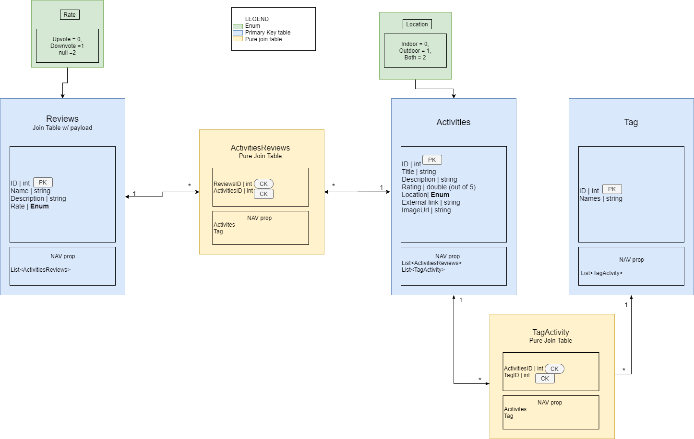
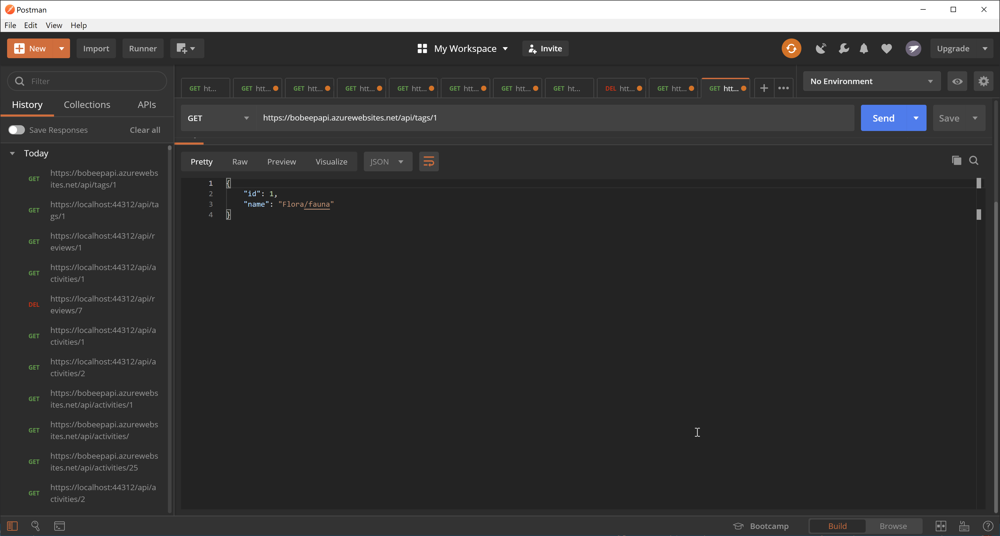

# Bored To Death - *The Boredom Killer*

### Deployed Websites

API: https://bobeepapi.azurewebsites.net/api  
Front-End: https://bopeepmvc.azurewebsites.net/

Swagger Site: https://bobeepapi.azurewebsites.net/swagger/index.html

---

## Authors

[Brody Rebne](https://github.com/brody-rebne)  
[Harlen Lopez](https://github.com/harlenlopez)  
[Harry Cogswell](https://github.com/HCoggers)  
[Jin Kim](https://github.com/jinwoov)  
[Rosalyn Johnson](https://github.com/rosbobos)

---

## Web Application

In a boring quarantine life, we need list of things that will satisfies our need and this web application is perfect to solve that problem. This application utilize ASP.NET core and MVC framework to present the data from API server. Activity can be added and users can review each activity.

---
## Visual

### ERD

### Screenshot of activities API

### Screenshot of tags API

### Screenshot of reviews API

---

## Tools Used
[Microsoft Visual Studio Community 2019](https://visualstudio.microsoft.com/)

- C#
- ASP.Net Core
- Entity Framework
- MVC
- [MySQL](https://www.mysql.com)
- [Azure](https://portal.azure.com)
- [Postman](https://www.postman.com/)

---

## Change Logs
2.1 - *Default data are updated with new images* - April 16, 2020  
2.0 - *Creating a review will recalibrate the rating of that activity* - April 15, 2020  
1.2 - *Creating a review will link to activity* - April 15, 2020  
1.1 - *Creating a activity with tag will link it together* - April 15, 2020  
1.0 - *Documentation is updated and site is fully functional* - April 14, 2020  
0.5 - *Reviews, activities, and tags are linked together* - April 14, 2020  
0.4 - *Routes are created for all of the models* - April 14, 2020  
0.3 - *Routes created for activities* - April 13, 2020  
0.2 - *Created MVC files and deployed website* - April 13, 2020  
0.1 - *Initialized README document* - April 13, 2020  