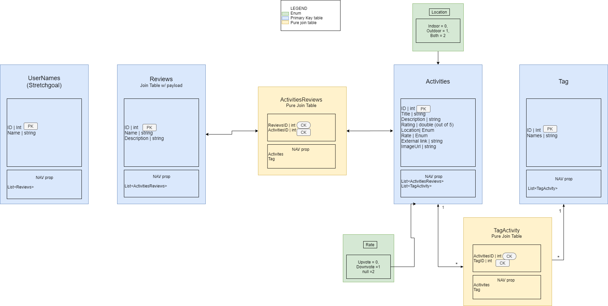
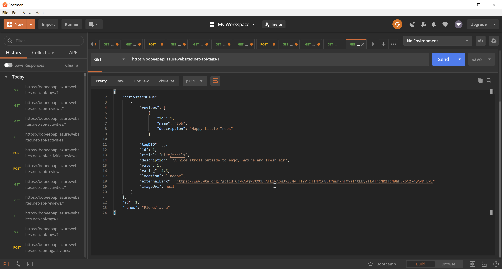
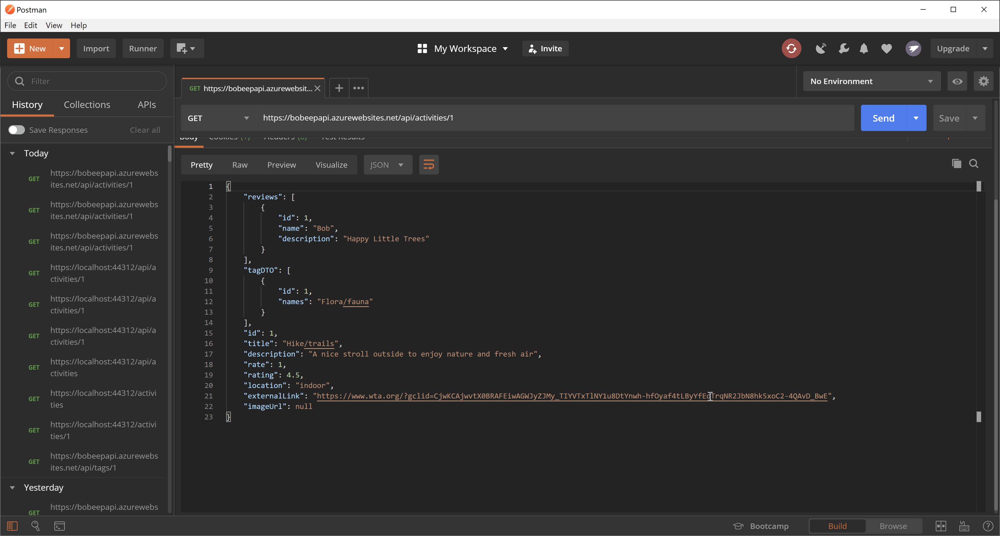
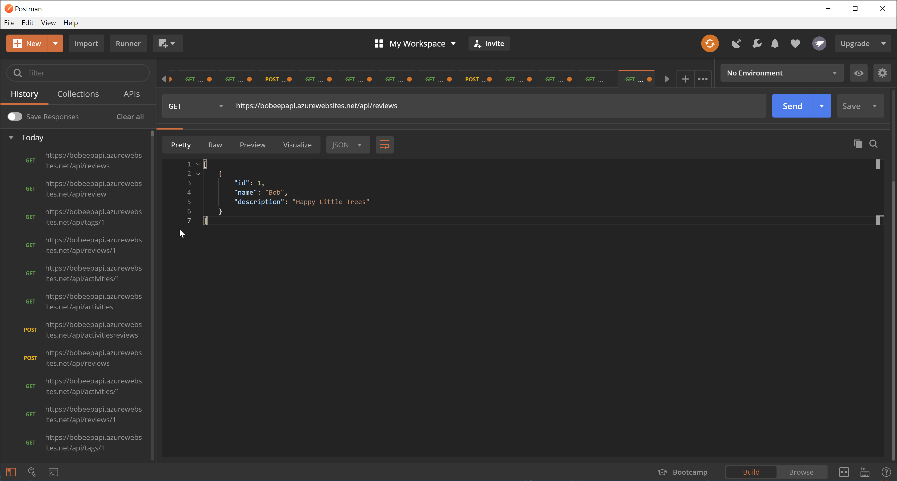

# Bored To Death - *The Boredom Killer*

### Deployed API

https://bobeepapi.azurewebsites.net/api

Swagger Site: https://bobeepapi.azurewebsites.net/swagger/index.html

---

## Authors

[Brody Rebne](https://github.com/brody-rebne)  
[Harlen Lopez](https://github.com/harlenlopez)  
[Harry Cogswell](https://github.com/HCoggers)  
[Jin Kim](https://github.com/jinwoov)  
[Rosalyn Johnson](https://github.com/rosbobos)

---
## Visual

### ERD

### Screenshot of tags API

### Screenshot of activities API

### Screenshot of reviews API

---

## Web Application

This application is created to suggest and review activities that we can do during our quarantine life. This application is consists of CRUD operation that utilize API backend server and ASP.NET core viewmodel for frontend. The framework of this application is build upon MVC framework. 

---

## Tools Used
Microsoft Visual Studio Community 2019

- C#
- ASP.Net Core
- Entity Framework
- MVC
- Azure
- Postman

---

## Change Logs
1.0 - *Documentation is updated and site is fully functional* April 14 2020  
0.5 - *Reviews, activities, and tags are linked together* April 14 2020  
0.4 - *Routes are created for all of the models* April 14 2020  
0.3 - *Routes created for activities* April 13 2020  
0.2 - *Created MVC files and deployed website* April 13 2020  
0.1 - *Initialized README document* April 13 2020  